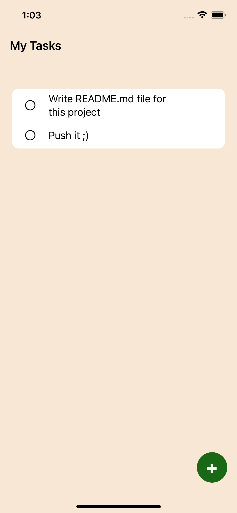

<h1>Swift ToDo App</h1>

<h2>Screens: </h2>

<p align="center"></p>

<h2>Usage: </h2>

```bash

git clone https://github.com/universal-developer/Swift-To-Do-App-By-DesignCode

xed Swift-To-Do-App-By-DesignCode

```

<h2>Link on video: </h2>

```bash

https://youtu.be/b6q9vKaXtoU

```
